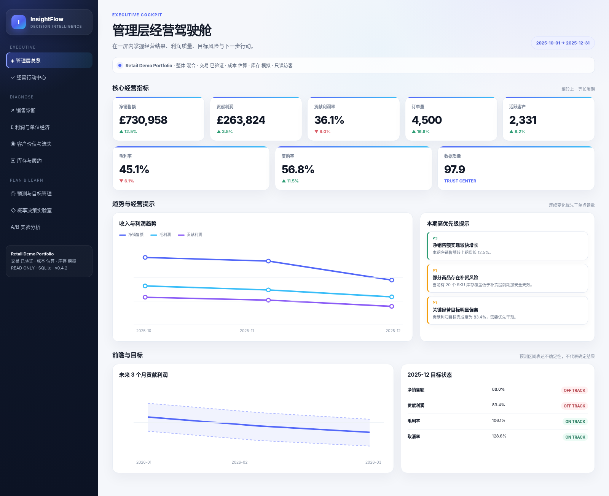

# InsightFlow v1.0.0


> **v0.0.3.3 筛选可靠性与客户留存修复：** 细分维度改为区域→国家→品类→渠道的级联联动，并显示当前命中样本；0订单和少于5笔订单时不再生成误导性的百分比变化；修复客户队列留存报错；行动状态改为“未闭环”口径；数据接入中心新增全量替换模式。

> **v0.0.2.1 修复：** 已为每个 Streamlit 页面设置唯一 URL，解决多页面均被推断为 `/render` 的启动错误。

> 面向商业分析、数据分析、运营、咨询和数字化岗位的可信经营分析与概率决策平台。

InsightFlow 将单文件或多表业务数据转换为可审计的数据仓库、经营指标、利润诊断、预测、情景模拟、A/B实验、行动清单和管理层报告。当前版本的重点不是继续堆叠图表，而是明确区分**真实、估算和模拟数据**，并让每个重要结论都能追溯到指标、规则、证据和不确定性。

v1.0.0 Portfolio Edition

本版重构了完整 Streamlit 视觉系统，采用深海军蓝导航、行政级浅色驾驶舱、统一KPI卡片、状态标签、图表主题、表格和交互控件。管理层总览由原来的七卡同排调整为主次指标层级，并统一所有页面的标题、留白和信息密度。



- 深色品牌侧栏与 Material Symbols 导航；
- 统一的页面标题、英文眉题和业务说明；
- 五张主KPI卡＋三张辅助指标卡，避免横向拥挤；
- Plotly 全局专业主题、统一字体和克制配色；
- 统一Tabs、按钮、表格、输入框、提示框与数据容器；
- 笔记本和移动端响应式布局；
- 独立静态界面预览：`portfolio/ui_preview_v0.4.2.html`。

## v1.0.0 核心能力

## 核心能力与工程特性

* **实验结果可复现**：采用基于 SHA-256 的稳定随机种子生成机制，确保 Bootstrap 等随机过程在不同设备、不同进程和重复运行中保持一致。

* **经营行动持久化**：通过稳定的问题指纹识别和去重，将负责人、截止日期、处理状态及备注等信息持久化写入 SQLite，避免页面刷新后行动记录丢失或重复生成。

* **完整只读模式**：公开访客仅可浏览、筛选和下载结果，无法修改经营行动、运行故障注入演练或向服务器磁盘写入报告，提升公开部署的安全性。

* **内存化报告生成**：HTML 与 Word 报告可直接在内存中生成并下载，无需落盘，适用于只读文件系统、多用户访问及云端公开部署。

* **智能查询缓存**：依据 SQLite 主数据库与 WAL 文件的版本变化缓存只读查询结果；数据更新后自动失效，在保证结果一致性的同时提升页面响应速度。

* **标准化命令行工具**：提供统一的 CLI 入口，支持 `insightflow bootstrap`、`validate`、`report`、`benchmark` 和 `run` 等命令，覆盖数据初始化、质量验证、报告生成、性能测试与应用启动。

* **部署安全加固**：Docker 容器采用非 root 用户运行，并配置健康检查、只读根文件系统、Linux 能力降权、资源限制及独立数据挂载，降低公开部署风险。

* **自动化测试体系**：已建立 33 项自动化测试，覆盖核心指标计算、数据契约、经营诊断、实验分析、报告生成及导入流程，核心后端测试覆盖率达到 83.8%。

* **数据可信度分级**：分别对交易、成本和库存数据标注 `Verified`、`Estimated`、`Simulated` 或 `Mixed`，明确区分真实数据、规则估算和模拟数据，避免误读分析结果。

* **指标信任元数据**：每项核心指标均记录业务定义、负责人、数据状态、可信度、来源说明及更新信息，增强指标口径的一致性与可追溯性。

* **正式数据契约**：对必要字段、业务主键、字段类型、日期范围、数值边界、枚举值及未来日期进行系统检查，在数据进入分析链路前识别潜在质量问题。

* **故障注入演练**：可在内存副本中主动注入重复记录、字段缺失、负价格、未来日期、未知渠道和月份缺口，用于验证数据质量体系是否能够准确识别异常，且不会污染正式数据库。

* **多种数据结构支持**：同时支持单表零售数据、七表电商数据结构，并提供面向公开 Olist 数据集的多表适配器，展示多源数据建模与关联分析能力。

* **概率决策实验室**：在传统点估计基础上引入 Monte Carlo 模拟，输出利润改善概率、90%结果区间及“收入增长但利润下降”的风险概率，使方案评估更符合真实经营决策中的不确定性。

* **A/B 实验分析中心**：综合评估转化率、单客收入、贡献利润和退货率，并提供 Bootstrap 区间及业务护栏；当实验提升收入但损害利润时，系统会阻止直接全量推广。

* **经营行动闭环**：将异常诊断、目标偏差和库存风险自动转化为带有数据证据、优先级、建议措施、负责人和截止日期的行动清单，推动分析结果进入实际管理流程。

* **预测评价体系升级**：在 MAE、RMSE 和 MAPE 之外，引入 WAPE、sMAPE、MASE 和 Bias，从准确性、稳定性和系统偏差等多个维度评价预测模型。

* **Power BI 模型交付包**：可导出交易事实表、客户与商品维度表、实验数据表和治理表，并提供 DAX 指标、星型模型关系图及页面设计蓝图，便于快速搭建企业级 BI 看板。

* **招聘与作品集材料**：配套提供 90 秒演示脚本、利润下降分析案例、项目能力说明、性能基准及作品集展示材料，便于在简历、GitHub 和面试中完整呈现项目价值。


## 中国与全球市场覆盖

- 内置演示仓库覆盖30个国家和地区、8个市场区域；
- 中国是核心市场，中文界面显示为“中国”，数据库稳定存储为 `China`；
- 中国香港、中国澳门分别存储为 `Hong Kong SAR` 和 `Macao SAR`，统一归入大中华区；
- 支持中文、英文缩写和常见别名自动归一，例如 `中国`、`PRC`、`CN` 均映射到 `China`；
- 新增市场区域筛选，可直接比较大中华区、东亚、东南亚、欧洲、北美等区域；
- 详细口径见 [地域与市场区域模型](docs/geography.md)。

## 应用入口

### Executive

- 管理层总览
- 经营行动中心

### Diagnose

- 销售诊断
- 利润与单位经济
- 客户价值与流失
- 商品分析
- 库存与履约
- 异常根因诊断

### Plan & Learn

- 预测与目标管理
- 概率决策实验室
- A/B实验分析

### Ask

- 受控经营分析助手

### Data Operations

- CSV、Excel和Parquet数据接入；多工作表Excel优先读取 `transactions` 或首个满足必要字段的工作表
- 数据契约预检与增量导入；P0/P1阻断导入，P2作为未登记类别提示
- 文件夹监听与准实时微批更新

### Trust & Deliver

- 数据信任中心
- Word、HTML和Markdown经营周报

## 快速启动

### Windows

```powershell
cd InsightFlow_Pro_v0.4.3.3
python -m venv .venv
.\.venv\Scripts\Activate.ps1
pip install -r requirements.txt
insightflow bootstrap
insightflow run
```

本地运行默认绑定 `127.0.0.1:8501`，不会主动暴露到局域网；Docker通过环境变量绑定 `0.0.0.0`。

也可以双击：

```text
run_windows.bat
```

### Docker

```bash
docker compose up --build
```

访问：

```text
http://localhost:8501
```

## 统一命令行与运行模式

安装项目后可使用：

```bash
insightflow bootstrap
insightflow validate
insightflow report
insightflow benchmark --runs 20
insightflow run
```

公开演示建议设置：

```text
INSIGHTFLOW_READ_ONLY=true
INSIGHTFLOW_APP_ENV=public-demo
```

只读模式允许查询和下载，但禁止行动状态写回、故障演练以及服务器端报告落盘。

## 数据配置

### 1. 完整演示配置

```bash
insightflow bootstrap
```

生成约10万条可重复交易记录以及成本、客户、库存、目标和实验数据。全部明确标记为 Simulated。

### 2. 七表演示配置

```bash
python scripts/bootstrap_multitable.py
```

生成并连接：

```text
orders
order_items
customers
products
payments
shipments
inventory
```

目标是展示主外键、多表连接、Join验证和统一事实粒度。

### 3. UCI兼容交易数据

```bash
python scripts/import_uci.py --input "D:\data\online_retail_II.xlsx"
```

交易字段标记为 Verified；缺失的成本、营销、库存和弹性字段标记为 Estimated 或 Simulated。

### 4. Olist公共多表数据

```bash
python scripts/import_olist.py --directory "D:\data\olist" --db data\warehouse\olist.db
```

详见：[Olist导入说明](docs/olist_import.md)。

## 数据契约与故障演练

单独验证数据源：

```bash
python scripts/validate_contract.py --input data/raw/demo_transactions.csv
```

生成故障数据：

```bash
python scripts/inject_data_faults.py \
  --input data/raw/demo_transactions.csv \
  --output data/raw/demo_transactions_corrupted.csv
```

正式仓库不会被故障演练污染。

## 报告、Power BI与性能

```bash
python scripts/build_static_report.py
python scripts/export_powerbi.py
python scripts/benchmark.py
```

输出包括：

```text
reports/insightflow_business_report.html
reports/insightflow_weekly_report.docx
reports/performance_benchmark.json
exports/powerbi/*.csv
powerbi/dax_measures.md
powerbi/data_model.mmd
powerbi/report_blueprint.md
```

当前环境不能直接生成原生 `.pbix` 文件，因此仓库提供可导入数据、完整DAX、模型关系和页面蓝图；原生PBIX需在Power BI Desktop中建立。

## 关键分析方法

### 利润对账

```text
净销售额 = 商品毛额 − 折扣
毛利润 = 净销售额 − 商品成本
贡献利润 = 毛利润 − 物流 − 支付 − 营销 − 退货处理
```

测试会验证各部分与汇总值精确对账。

### 收入与利润诊断

- 收入Shapley分解：活跃客户、购买频次和客单价；
- 利润桥接：净销售额、毛利率和可变经营成本；
- 国家、品类、渠道和商品贡献定位。

### 预测

系统通过滚动回测比较朴素、移动平均、漂移、趋势、指数平滑和季节性模型，评价指标包括：

- MAE；
- RMSE；
- WAPE；
- sMAPE；
- MASE；
- Bias。

### 概率情景模拟

价格弹性、需求、营销响应、采购成本和物流冲击以可见分布进入 Monte Carlo 模拟。系统报告：

- 利润变化中位数；
- 90%结果区间；
- 利润改善概率；
- 收入上升但利润下降概率；
- 关键参数敏感性排序。

### 实验分析

实验中心同时评价：

- 转化率；
- 单客收入；
- 单客贡献利润；
- 退货率护栏；
- Bootstrap置信区间和改善概率。

## 测试

```bash
PYTHONPATH=src PYTEST_DISABLE_PLUGIN_AUTOLOAD=1 pytest -q
```

当前结果：

```text
33 passed｜核心后端覆盖率 83.8%
```

覆盖数据清洗、契约、利润对账、Shapley分解、预测、目标、库存、增量ETL、来源标签、Monte Carlo、实验护栏、多表转换和报告输出。

## 招聘展示材料

- [90秒演示脚本](docs/demo_script_90s.md)
- [利润下降商业案例](docs/case_studies/profit_decline_case.md)
- [数据配置与可信度说明](docs/data_profiles.md)
- [招聘作品集指南](docs/recruiter_portfolio_guide.md)
- [Power BI报告蓝图](powerbi/report_blueprint.md)

## 推荐简历表述

> **InsightFlow Pro：可信经营分析与概率决策平台**｜Python、SQL、SQLite、Streamlit、Plotly、Power BI、A/B Testing  
> - 搭建从单表/多表数据接入、数据契约、增量ETL和星型建模，到经营诊断、预测、实验分析和管理报告的端到端流程，处理约10.7万条演示交易记录。  
> - 建立净销售额、毛利润、贡献利润、客户价值、库存覆盖和目标完成度等指标，并为每个指标增加来源状态、置信度、负责人和血缘，区分真实、估算与模拟数据。  
> - 使用Shapley分解与利润桥接定位经营变化，通过Monte Carlo模拟量化利润改善概率和下行区间，并构建利润护栏A/B实验模块，识别“增收但减利”的促销方案。  
> - 开发经营行动中心、受控自然语言查询、Word/HTML自动周报和Power BI模型包；使用33项自动化测试验证财务对账、增量幂等性、数据契约和实验决策逻辑。

## 边界说明

- 内置交易、成本、库存、目标和实验均用于演示，不代表真实企业结果；
- UCI和Olist适配器可验证公开源字段，但源中不存在的成本和库存仍会明确标记为估算或模拟；
- 当前CLV和流失风险为透明基准方法，不应描述为经过真实标签验证的机器学习预测；
- 情景模拟表达假设与风险，不构成确定性经营承诺；
- 真正企业部署还需要身份认证、权限、正式数据负责人、监控、备份和隐私治理。

## License

MIT
## 作者

独立设计与开发：Zhao Yushen

本项目使用 AI 编程工具辅助完成部分代码编写、测试、调试和文档整理，
核心产品设计、业务框架、功能选择与验收由作者完成。
